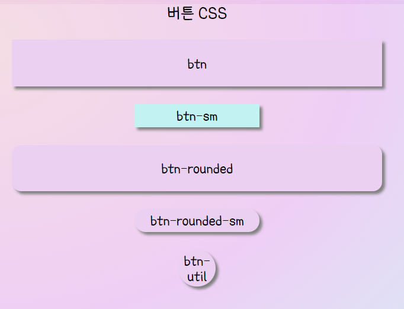

## 아이콘


## 테마색


## 공통 버튼 CSS




## 커스터마이징 하고 싶으면

```react
import React from 'react';
import 'src/common/commonCss/common.css';
import 'src/common/commonCss/videoChat.css';

<div>
    <button className="videoChat-btn-sm btn-sm">btn-sm</button>  // 커스터마이징한 css가 앞에 가도록
</div>
```

