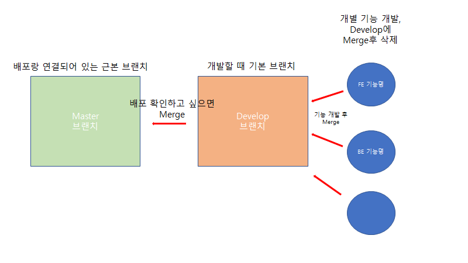
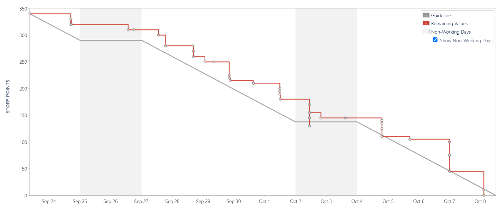

## 👩🏻‍🤝‍🧑🏻 애블데이 (애니멀 블라인드 데이트)

#### 선호하는 동물(얼굴)상의 이성을 매칭해주는 블라인드 화상 채팅

## 🤔제작배경

- **비대면 활동 증가에 따른 소개팅 서비스 관심 증가**
- **기존 서비스의 단점인 서비스의 심리적 장벽과 매칭 과금 유도를 보완**
- **다른 서비스에 비해 소개팅어플 시장은 신규 플랫폼에 대한 관심도가 높음**

## 😎차별점 & 특징

- **흥미적요소**
  - AI를 통한 User들의 동물상 구분
  - 화상채팅 중 AI를 통해 상대방의 호감도 체크
- **선별 기능**
  - User들끼리 서로 원하는 동물상과의 랜덤 매칭 가능
  - 리뷰 및 간략 정보 확인 후 서로 동의해야 화상채팅 시작 
- **프라이버시**
  - 화상 채팅 중 얼굴 공개 / 숨김 전환 가능
  - 친구추가를 한 사용자 제외 무분별한 접근 차단

## 🌈SW 아키텍쳐

## 🌊 Git Flow 전략

## 🤝 Commit Convention

ex)  "[jira이슈번호] [FE-조현식] feat: 메인페이지 무한스크롤 기능 추가"

| keyword  | 내용             |
| -------- | ---------------- |
| fix      | 버그 수정        |
| docs     | 문서 수정        |
| refactor | 코드 리펙토링    |
| test     | 테스트           |
| feat     | 새로운 기능 추가 |

## 😙팀구성

- 김도연
  - Data수집 / AI모델링 / AI 서버 구축 / BE
- 류지우
  - 로그인 / 회원가인 / 메인(퀵매치)페이지 / FE
- 이원종
  - redux / 마이페이지 / 채팅 / 채팅서버 / FE
- 정동원
  - 매칭시스템 / 인증 / backend api / 서비스서버 / BE
- 조현식
  - openvidu 화상채팅 / FE / 팀장 

## 🌎프로젝트 관련 링크

| 클릭 시 노션으로 슝                                          |
| :----------------------------------------------------------- |
| [와이어프레임](https://www.notion.so/dad30e3064ef4f319072e12590a00858) |
| [회의록](https://www.notion.so/24a741c90bad4608bc9a14d56d6fde99?v=1e3d3efc71824ca89ec9b28e054ae613) |
| [API문서](https://www.notion.so/7152d1e6ac264759a3392128283c2cb7?v=6dd08abc6a48465c91dc4ed28d2c6006) |
| [컴포넌트구조](https://www.notion.so/79f8f9583dce43c380a80e93016229ec) |
| [ERD](https://www.notion.so/ERD-ae13c466ba1f416e93d61b0346c886b0) |
| [기능명세서](https://www.notion.so/3c1334be473d428a904779836eddb080?v=934f2436d30c403ca0906b0ddd1975cb) |

## 🛫Sprint 번다운차트

